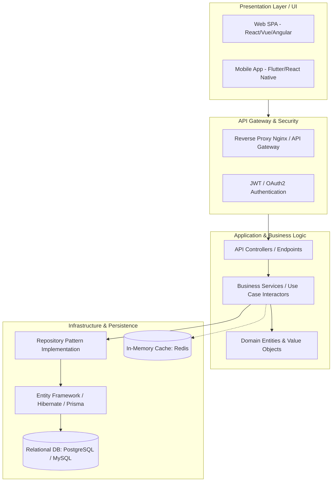
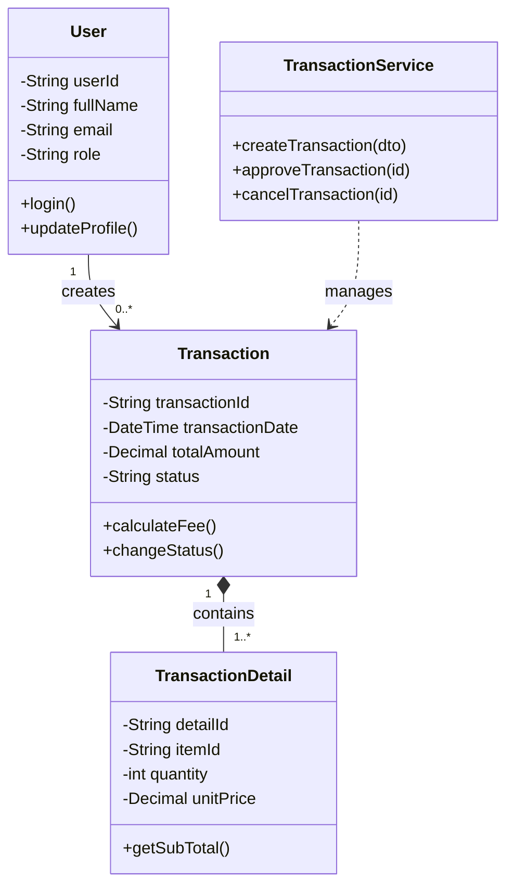

# 🏛️ HỒ SƠ THIẾT KẾ KIẾN TRÚC & PHÂN TÍCH HƯỚNG ĐỐI TƯỢNG (OOAD)

## 1. MÔ HÌNH KIẾN TRÚC TỔNG THỂ (3-TIER / CLEAN ARCHITECTURE)

Hệ thống được thiết kế theo mô hình phân tầng chuẩn công nghiệp nhằm đảm bảo tính độc lập, dễ bảo trì và dễ viết Unit Test:



---

## 2. PHÂN TÍCH THIẾT KẾ HƯỚNG ĐỐI TƯỢNG (OOAD & UML)

### 2.1. Phân Loại Đối Tượng & Lớp (Class Diagram Design)
Trong dự án hướng đối tượng, các lớp được phân chia theo 3 nhóm vai trò cơ bản (BCE Pattern - Boundary, Control, Entity):
1. **Boundary Classes (Lớp giao tiếp):** Các lớp phụ trách nhận yêu cầu từ người dùng hoặc hệ thống ngoài (UI Forms, API Controllers).
2. **Control Classes (Lớp điều khiển):** Các lớp chứa quy tắc nghiệp vụ và điều phối luồng thực thi (Service Classes, Handlers).
3. **Entity Classes (Lớp thực thể):** Các lớp mô hình hóa dữ liệu cốt lõi của bài toán kinh doanh (User, Transaction, Product, Order).



---

### 2.2. Biểu Đồ Tuần Tự (Sequence Diagram - Luồng Tạo Giao Dịch)
Mô tả sự tương tác tuần tự giữa các đối tượng trong thời gian thực thi:

```mermaid
sequenceDiagram
    autonumber
    actor Staff as Nhân Viên Nghiệp Vụ
    participant UI as Giao Diện (Boundary)
    participant Auth as Bộ Xác Thực (Auth)
    participant Ctrl as TransactionController
    participant Svc as TransactionService (Control)
    participant Repo as TransactionRepository
    database DB as Cơ Sở Dữ Liệu (Entity)

    Staff->>UI: Điền thông tin giao dịch & nhấn "Lưu"
    UI->>Auth: Kiểm tra quyền thao tác
    Auth-->>UI: Quyền hợp lệ
    UI->>Ctrl: POST /api/transactions (Payload DTO)
    Ctrl->>Svc: createTransaction(dto)
    activate Svc
    Svc->>Svc: Validate nghiệp vụ & tính toán số tiền
    Svc->>Repo: save(transactionEntity)
    activate Repo
    Repo->>DB: INSERT INTO transactions...
    DB-->>Repo: Xác nhận lưu thành công (ID)
    Repo-->>Svc: Entity đã lưu
    deactivate Repo
    Svc-->>Ctrl: TransactionResult DTO
    deactivate Svc
    Ctrl-->>UI: HTTP 201 Created (JSON Response)
    UI-->>Staff: Hiển thị thông báo thành công & in biên lai
```

---

## 3. THIẾT KẾ CƠ SỞ DỮ LIỆU (DATABASE SCHEMA - ERD)
- **Chuẩn hóa:** Toàn bộ bảng dữ liệu bắt buộc chuẩn hóa tối thiểu đạt **3NF (Third Normal Form)**.
- **Tính toán toàn vẹn:** Sử dụng đầy đủ Foreign Keys kèm ràng buộc `ON DELETE RESTRICT` hoặc `ON DELETE CASCADE` phù hợp.
- **Audit Logging:** Tất cả các bảng quan trọng phải có các cột giám sát:
  - `created_at` (Thời điểm tạo)
  - `created_by` (Người tạo)
  - `updated_at` (Thời điểm sửa)
  - `updated_by` (Người sửa)
  - `is_deleted` (Cờ Soft Delete - Xóa mềm)
