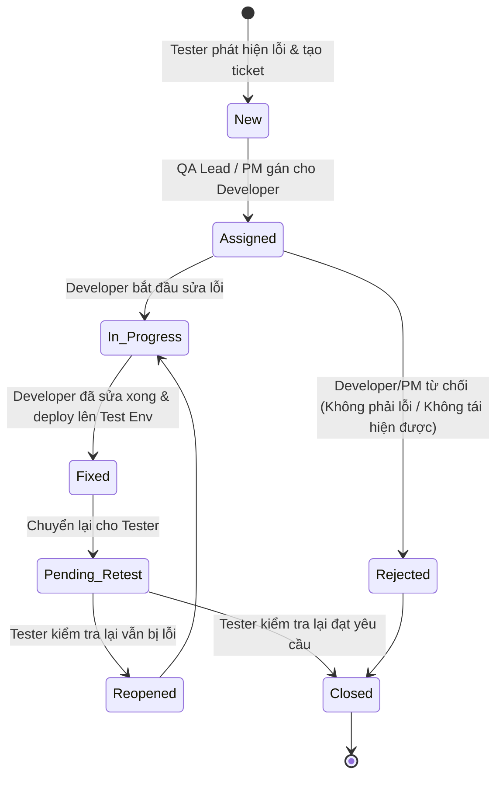

# 🧪 KẾ HOẠCH KIỂM THỬ & VÒNG ĐỜI XỬ LÝ LỖI (BUG LIFE CYCLE)

## 1. VÒNG ĐỜI XỬ LÝ LỖI (BUG LIFE CYCLE) TRONG DOANH NGHIỆP

---

## 2. PHÂN LOẠI MỨC ĐỘ NGHIÊM TRỌNG CỦA BUG (SEVERITY)

| Mức độ | Định nghĩa | Ví dụ thực tế | Thời gian xử lý tối đa (SLA) |
|---|---|---|:---:|
| **Critical (Blocker)** | Lỗi làm sập toàn bộ hệ thống, mất mát dữ liệu hoặc chặn đứng luồng chính không thể tiếp tục test | - Không thể đăng nhập vào hệ thống. - Lỗi thanh toán trừ tiền sai lệch nghiêm trọng. - Sập máy chủ CSDL. | **Trong vòng 2 - 4 giờ** |
| **Major (High)** | Lỗi chức năng chính bị sai lệch lớn nhưng vẫn có cách tạm thời để tiếp tục kiểm thử | - Không lưu được hồ sơ khách hàng mới. - Sai công thức tính tổng tiền hóa đơn. - Nút phê duyệt bị đơ. | **Trong vòng 24 giờ** |
| **Medium (Normal)** | Lỗi chức năng nhỏ, không ảnh hưởng đến luồng hoạt động chính | - Bộ lọc tìm kiếm theo ngày hoạt động sai. - Thiếu thông báo xác nhận khi xóa dữ liệu. - Báo cáo xuất file Excel bị mất 1 cột. | **Trong vòng 2 - 3 ngày** |
| **Minor (Low)** | Lỗi thẩm mỹ, giao diện, sai chính tả | - Sai lỗi chính tả trên nhãn giao diện. - Nút bấm bị lệch 5px. - Màu sắc không đúng với bản thiết kế Figma. | **Xử lý vào cuối Sprint** |

---

## 3. MẪU BIỂU KỊCH BẢN KIỂM THỬ (TEST CASE SPECIFICATION TEMPLATE)

| Trường thông tin | Nội dung chi tiết |
|---|---|
| **Test Case ID** | TC-TRANS-01 |
| **Module / Tính năng** | Quản lý giao dịch - Tạo mới giao dịch |
| **Tác giả (Author)** | Nguyễn Văn A (QC Engineer) |
| **Tiền điều kiện (Preconditions)** | 1. Người dùng đã đăng nhập vào hệ thống bằng tài khoản nhân viên hợp lệ. 2. Đã có sẵn dữ liệu khách hàng trong hệ thống. |
| **Các bước thực hiện (Steps to Reproduce)** | 1. Truy cập menu "Giao dịch" -> Chọn "Tạo mới". 2. Nhập mã khách hàng hợp lệ: `KH00123`. 3. Chọn danh mục dịch vụ và nhập số lượng `2`. 4. Nhấn nút "Lưu và In phiếu". |
| **Dữ liệu kiểm thử (Test Data)** | Khách hàng: `KH00123`, Dịch vụ: `DV-BASIC`, Số lượng: `2`. |
| **Kết quả mong đợi (Expected Result)** | - Hệ thống tự động tính thành tiền chính xác. - Bản ghi được lưu vào CSDL với trạng thái `PENDING`. - Hiển thị popup thông báo thành công và mở cửa sổ in phiếu. |
| **Kết quả thực tế (Actual Result)** | Đúng như mong đợi (Pass) / Hoặc mô tả sai lệch nếu Fail. |
| **Trạng thái (Status)** | **PASS** / **FAIL** / **BLOCKED** |
