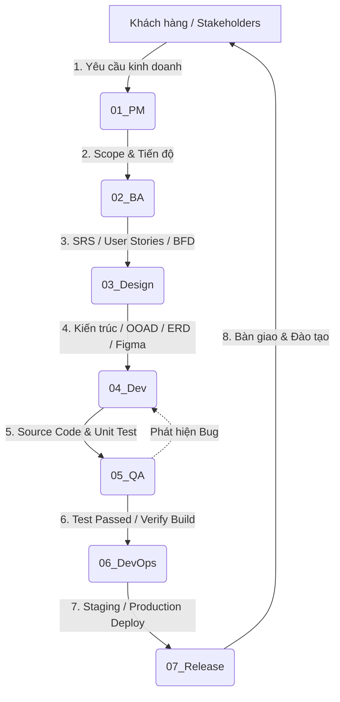

# 🏢 CẤU TRÚC DỰ ÁN PHẦN MỀM CHUẨN DOANH NGHIỆP (PROJECT_1)

> Cấu trúc thư mục được tinh gọn theo tên các phòng ban / vai trò thực tế trong các công ty công nghệ (IT Software House / Enterprise), áp dụng chuẩn **Agile/Scrum** và **CMMI**.

---

## 📌 1. CÂY THƯ MỤC TINH GỌN (PROJECT TREE)

```text
PROJECT_1/
├── 01_PM/          # Quản lý dự án, tiến độ, nhân sự, rủi ro (Project Manager / Scrum Master)
├── 02_BA/          # Khảo sát nghiệp vụ, phân tích yêu cầu, SRS (Business Analyst / Product Owner)
├── 03_Design/      # Thiết kế kiến trúc, mô hình OOAD, CSDL & UI/UX (Architect / Tech Lead / UI-UX)
├── 04_Dev/         # Lập trình, quy chuẩn code, mã nguồn hệ thống (Developers / Tech Lead)
├── 05_QA/          # Kiểm thử, kịch bản test, báo cáo lỗi (QA / QC Tester)
├── 06_DevOps/      # Tự động hóa CI/CD, Docker, hạ tầng & triển khai (DevOps Engineer)
├── 07_Release/     # Phát hành phiên bản, bàn giao, hướng dẫn & bảo trì (PM / Support / Ops)
└── README.md       # Tổng quan quy trình dự án & ma trận phân nhiệm RACI
```

---

## 👥 2. MA TRẬN PHÂN NHIỆM TRÁCH NHIỆM (RACI MATRIX)

| Khâu công việc | PM / Scrum Master | BA / PO | Architect / Lead | Developers | QA / QC | DevOps |
|---|:---:|:---:|:---:|:---:|:---:|:---:|
| **[01_PM](./01_PM/)** (Kế hoạch & Quản lý) | **A / R** | C | C | I | I | I |
| **[02_BA](./02_BA/)** (Yêu cầu nghiệp vụ) | A | **R** | C | I | C | I |
| **[03_Design](./03_Design/)** (Kiến trúc & Thiết kế) | A | C | **A / R** | C | I | C |
| **[04_Dev](./04_Dev/)** (Lập trình phát triển) | A | I | C | **R** | C | I |
| **[05_QA](./05_QA/)** (Kiểm thử chất lượng) | A | C | C | C | **R** | I |
| **[06_DevOps](./06_DevOps/)** (CI/CD & Hạ tầng) | A | I | C | C | I | **R** |
| **[07_Release](./07_Release/)** (Bàn giao & Vận hành) | **A / R** | C | C | C | C | C |

*Chú thích:*
- **R (Responsible):** Người trực tiếp thực hiện.
- **A (Accountable):** Người chịu trách nhiệm phê duyệt cao nhất.
- **C (Consulted):** Người được tham vấn chuyên môn.
- **I (Informed):** Người được thông báo tiến độ.

---

## 🔄 3. QUY TRÌNH PHỐI HỢP LIÊN PHÒNG BAN (WORKFLOW)



---

## 📂 4. CHI TIẾT TỪNG THƯ MỤC CHỨC NĂNG

### 🔹 [01_PM (Project Management)](./01_PM/)
- **Mục đích:** Định hình phạm vi, nguồn lực, chi phí, tiến độ và kiểm soát rủi ro.
- **Tài liệu chính:**
  - [`01_PM/README.md`](./01_PM/README.md): Hướng dẫn quản trị dự án.
  - [`01_PM/WBS.md`](./01_PM/WBS.md): Bảng phân rã công việc chi tiết từ cấp độ 1 đến cấp độ công việc cụ thể.
  - [`01_PM/RACI.md`](./01_PM/RACI.md): Ma trận phân công nhiệm vụ cho từng vị trí.

### 🔹 [02_BA (Business Analysis)](./02_BA/)
- **Mục đích:** Thu thập hiện trạng và chi tiết hóa yêu cầu nghiệp vụ của bài toán.
- **Tài liệu chính:**
  - [`02_BA/README.md`](./02_BA/README.md): Hướng dẫn khảo sát và quy trình BA.
  - [`02_BA/SRS.md`](./02_BA/SRS.md): Khung mẫu đặc tả yêu cầu phần mềm chuẩn IEEE 830 (Sơ đồ ngữ cảnh, phân rã BFD, quy tắc nghiệp vụ, từ điển dữ liệu).

### 🔹 [03_Design (Architecture & UI/UX)](./03_Design/)
- **Mục đích:** Bản vẽ kỹ thuật cho hệ thống, mô hình hóa hướng đối tượng và giao diện người dùng.
- **Tài liệu chính:**
  - [`03_Design/README.md`](./03_Design/README.md): Quy chuẩn thiết kế hệ thống.
  - [`03_Design/Architecture_OOAD.md`](./03_Design/Architecture_OOAD.md): Kiến trúc Clean Architecture / 3-Tier, Biểu đồ lớp (Class Diagram), Biểu đồ tuần tự (Sequence Diagram), Lược đồ CSDL (ERD 3NF).

### 🔹 [04_Dev (Development)](./04_Dev/)
- **Mục đích:** Lưu trữ mã nguồn, quy chuẩn code và hướng dẫn lập trình.
- **Cấu trúc & Tài liệu:**
  - [`04_Dev/README.md`](./04_Dev/README.md): Hướng dẫn Developer và luồng làm việc hàng ngày.
  - [`04_Dev/docs/GitFlow_Conventions.md`](./04_Dev/docs/GitFlow_Conventions.md): Quy tắc đặt tên Clean Code, SOLID và chiến lược quản lý nhánh GitFlow.
  - `src/backend/`: Mã nguồn Backend API.
  - `src/frontend/`: Mã nguồn giao diện Web / Mobile App.
  - `src/database/`: Kịch bản Migration và Seed CSDL.

### 🔹 [05_QA (Quality Assurance & Testing)](./05_QA/)
- **Mục đích:** Đảm bảo hệ thống đạt chuẩn chất lượng, chạy đúng yêu cầu nghiệp vụ và bảo mật.
- **Tài liệu chính:**
  - [`05_QA/README.md`](./05_QA/README.md): Hướng dẫn quy trình QA/QC.
  - [`05_QA/TestPlan_BugWorkflow.md`](./05_QA/TestPlan_BugWorkflow.md): Vòng đời xử lý lỗi (Bug Life Cycle), phân loại mức độ nghiêm trọng (Severity) và mẫu viết Test Case.

### 🔹 [06_DevOps (DevOps & Infrastructure)](./06_DevOps/)
- **Mục đích:** Tự động hóa quá trình Build, Test, Security Scan và Deploy lên các môi trường (Dev/Staging/Prod).
- **Cấu trúc & Tài liệu:**
  - [`06_DevOps/README.md`](./06_DevOps/README.md): Hướng dẫn thiết lập pipeline CI/CD và giám sát hệ thống.
  - `docker/docker-compose.example.yml`: Cấu hình mẫu Docker Compose cho môi trường phát triển (Postgres, Redis, API, Web).

### 🔹 [07_Release (Release & Operations)](./07_Release/)
- **Mục đích:** Đóng gói phiên bản, đào tạo người dùng, bàn giao sản phẩm và hỗ trợ vận hành bảo trì.
- **Tài liệu chính:**
  - [`07_Release/README.md`](./07_Release/README.md): Quy trình phát hành và các cấp hỗ trợ bảo trì (L1, L2, L3).
  - [`07_Release/Release_Notes.md`](./07_Release/Release_Notes.md): Mẫu ghi chú phát hành phiên bản (Tính năng mới, tối ưu hóa, lỗi đã vá).

---

## 🎯 5. TIÊU CHÍ HOÀN THÀNH (DEFINITION OF DONE - DoD)
Một tính năng chỉ được xem là hoàn thành (Done) khi:
1. Đã có đặc tả Use Case / User Story được duyệt trong `02_BA`.
2. Có sơ đồ thiết kế kiến trúc và lược đồ CSDL được duyệt trong `03_Design`.
3. Code sạch, tuân thủ SOLID, pass SonarQube và được ít nhất 1 Tech Lead Approve trên PR trong `04_Dev`.
4. Pass 100% Unit Test và QA xác nhận không còn bug Blocker/Critical/Major trong `05_QA`.
5. Đã deploy thành công lên Staging thông qua pipeline tự động của `06_DevOps`.

---

## 🌐 6. QUẢN LÝ MÃ NGUỒN & HƯỚNG DẪN GITHUB (GIT & GITHUB WORKFLOW)
- **Hướng dẫn kết nối và đẩy lên GitHub:** Xem chi tiết tại [`04_Dev/docs/GitHub_Setup_Guide.md`](./04_Dev/docs/GitHub_Setup_Guide.md).
- **Danh mục 11 Issues từ SRS:** Xem chi tiết tại [`01_PM/GITHUB_ISSUES_BACKLOG.md`](./01_PM/GITHUB_ISSUES_BACKLOG.md).
- **Quy chuẩn GitFlow & Commit:** Xem tại [`04_Dev/docs/GitFlow_Conventions.md`](./04_Dev/docs/GitFlow_Conventions.md).
- **Kịch bản tự động hóa:** Script PowerShell tạo Labels, Milestones và Issues tại [`06_DevOps/scripts/create_github_issues.ps1`](./06_DevOps/scripts/create_github_issues.ps1).
- **Cấu hình chuẩn GitHub:**
  - Mẫu Issue: [Feature Request](./.github/ISSUE_TEMPLATE/01_feature_request.md) | [Bug Report](./.github/ISSUE_TEMPLATE/02_bug_report.md) | [WBS Task](./.github/ISSUE_TEMPLATE/03_task_wbs.md)
  - Mẫu Pull Request: [Pull Request Template](./.github/PULL_REQUEST_TEMPLATE.md)
  - Tự động hóa CI/CD: [GitHub Actions Workflow](./.github/workflows/ci.yml)

